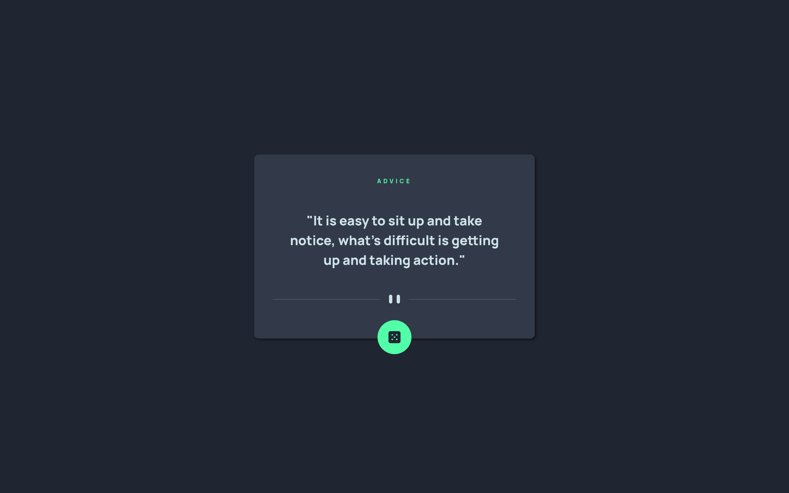

# Frontend Mentor - Advice Generator app solution

This is a solution to the [Advice Generator app challenge on Frontend Mentor](https://www.frontendmentor.io/challenges/advice-generator-app-QdUG-13db). Frontend Mentor challenges help you improve your coding skills by building realistic projects.

## Table of contents

- [Overview](#overview)
  - [The challenge](#the-challenge)
  - [Screenshot](#screenshot)
  - [Links](#links)
- [My process](#my-process)
  - [Built with](#built-with)
  - [What I learned](#what-i-learned)
  - [Useful resources](#useful-resources)
- [Author](#author)

## Overview

### The challenge

Users should be able to:

- View the optimal layout for the app depending on their device's screen size
- See hover states for all interactive elements on the page
- Generate a new piece of advice by clicking the dice icon

### Screenshot




### Links

- Repository: [Github](https://github.com/johnv2309/advice-generator-component)
- Solution: [Frontend Mentor](https://your-solution-url.com)
- Live Site: [Netlify](https://johnv2309-advice-generator-component.netlify.app/)

## My process

### Built with

- Semantic HTML5 markup
- CSS custom properties
- DOM Manipulation with Javascript
- Flexbox
- Mobile-first workflow

### What I learned

```js
const getAdvice = function () {
  fetch(`https://api.adviceslip.com/advice`)
    .then((response) => response.json())
    .then((data) => {
      adviceId.innerText = `#${data.slip.id}`;
      activeAdvice.innerText = `"${data.slip.advice}"`;
    })
    .catch((error) => console.log(error));
};
```

### Resources

- [Advice Slip API](https://api.adviceslip.com/) - The random advice API used in this project.

## Author

- Github - [@johnv2309](https://github.com/johnv2309)
- Frontend Mentor - [@johnv2309](https://www.frontendmentor.io/profile/johnv2309)
